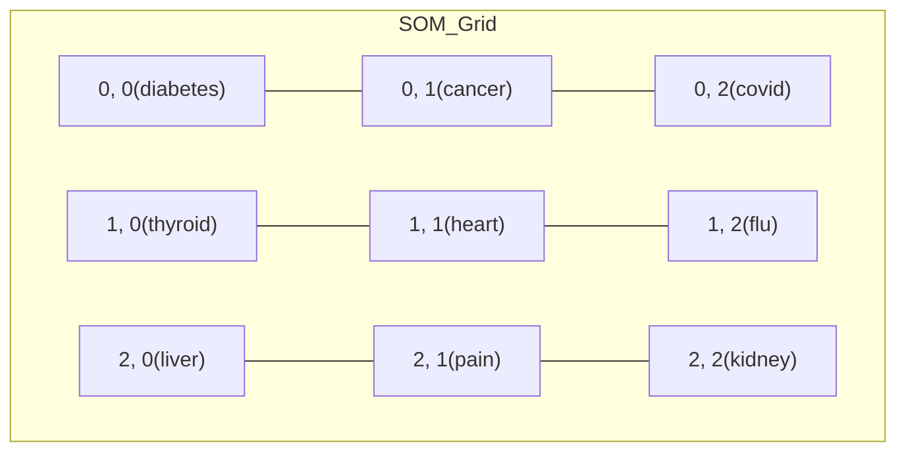

# 🧭 MediMap-XAI: Explainable Medical Search Framework

[](https://www.python.org/downloads/)  [](LICENSE)  [](https://streamlit.io)  [](https://www.mongodb.com/)  [](https://huggingface.co/)  

---

> **MediMap-XAI** is an **Explainable Medical Semantic Search & Clustering Framework** using **Self-Organizing Maps (SOMs)** with **BioBERT/SciBERT embeddings**.  
It enables **semantic clustering**, **interactive visualizations**, and **explainable retrieval** for unstructured medical data.

---

## 🔍 Overview

In the clinical domain, where interpretability can directly impact trust, MediMap-XAI integrates a semantic search backend with a powerful explainable layer based on SOMs, enabling users to:

- **Search** using free-text queries for clinical/medical documents.
- **Visualize** document clusters and contextual relevance.
- **Explain** search results through proximity on SOM clusters.
  
---

## 🧠 Why Self-Organizing Maps (SOM)?

In contrast to black-box models like deep neural nets, SOMs provide:

- **Topological preservation**: similar input vectors are mapped close together.
- **Clustering + visualization**: allowing a 2D representation of high-dimensional data.
- **Unsupervised learning**: ideal for unlabelled medical corpora.
- **Interpretable results**: clusters that explain similarity neighborhoods.

---

## 🤖 Why MiniSOM?

We chose [MiniSom](https://github.com/JustGlowing/minisom) because:

- It's a **lightweight**, pure Python implementation.
- Easily integrates with numpy/pandas-based pipelines.
- Ideal for visualization + embedding workflows.

---

## 🎯 Hero Features

- 🔹 **Interactive SOM heatmap with keyword overlay**  
- 🔹 **Explainable Query → Article mapping**  
- 🔹 **Clustered semantic space** for reports, queries, and articles  
- 🔹 **Streamlit UI** with cell inspector & top keywords  
- 🔹 **Confidence analysis** for search results with detailed metrics  
- 🔹 **Medical document upload** for symptom analysis   

---

## 🧩 Key Features

- **A. Data Ingestion & Embedding**

 - 1. Supports multiple unstructured medical datasets:

      - a. Clinical reports (mtsamples.csv)

      - b. Medical Q&A (medquad.csv)

      - c. Patient drug reviews (drugsCom.csv)

      - d. Optional: PubMed / CORD-19 abstracts


 - 2. Domain-specific embeddings using BioBERT / SciBERT**

- **B. SOM-Based Semantic Clustering**

 - 1. 2D map of semantic space

 - 2. Assigns each document to a som_cluster

 - 3. Saves trained SOM → models/som_model.pkl


- **C. Interactive Streamlit UI**

 - 1. Combined SOM heatmap

 - 2. Cell inspector with:

      - a. Occupancy by collection

      - b. Sample documents

      - c. Top TF-IDF keywords

 - 3. Query → Article explanation panel


- **D. Explainability (XAI Layer)**

 - 1. Why a document sits in its cluster

 - 2. Query → Article explanation:

      - a. Cosine similarity in embedding space

      - b. Cluster proximity in SOM grid

      - c. Token-level contribution via leave-one-out embeddings

---

## ⚙️ Features

### 1. Search Functionality

Users can:

- Submit free-text queries (e.g., "Type II diabetes neuropathy symptoms").
- Search is powered by cosine similarity on document embeddings (BERT/Sentence-BERT).
- Most similar document(s) returned with relevance score.

### 2. SOM Cluster Visualization

Visual cluster maps show:

- Cluster centers formed by SOM on clinical document embeddings.
- Density of document types across SOM regions.
- Query projected onto this map with distance to nearby clusters.

### 3. Explainability Layer

````markdown
  ```mermaid
  graph TD
    A[User Query] --> B[Embed using ClinicalBERT]
    B --> C[Project onto SOM Grid]
    C --> D[Get BMU (Best Matching Unit)]
    D --> E[Highlight Nearby Clusters]
    E --> F[Retrieve Cluster Documents]
    F --> G[Return Results with SOM-based Explanation]
  ```
```

Features:

- **Query projection**: Shows where the query lies on the 2D map.
- **Token attention overlay**: Identifies which parts of the query match cluster semantics.
- **Confidence Score**: Based on the SOM distance metric from BMU (Best Matching Unit).
- **Visual Diagnostics**: Shows how close a query is to different clinical clusters.

---

## 📊 Visual Outputs

All visual assets are saved in:

```bash
models/visualizations/
├── cluster_map.png              # Full SOM grid with clusters
├── query_projection.png         # Where the user's query hits
└── keyword_density_map.png      # Density of important tokens per region
```

These are dynamically updated and shown in the app during runtime.

---

## 🔹 Project Structure
```bash
MediMap-XAI/
├── app.py                         # Main Streamlit application
├── core/                          # Core application logic
│   ├── confidence_analyzer.py     # Confidence scoring and explanations
│   ├── file_handler.py            # File upload processing
│   ├── search_engine.py           # Semantic search implementation
│   ├── system_manager.py          # System initialization
├── data_ingestion.py              # Data ingestion pipeline
├── run_som_training.py            # SOM model training pipeline
├── src/                           # Core processing modules
│   ├── config.py                  # Paths and configurations
│   ├── db.py                      # MongoDB operations
│   ├── embedder.py                # BioBERT/SciBERT embeddings
│   ├── explainer.py               # Explanation generation
│   ├── ingest.py                  # Data ingestion logic
│   ├── search.py                  # Vector search implementation
│   ├── som_clusterer.py           # SOM training and clustering
│   ├── som_visualizer.py          # SOM visualization tools
│   └── utils.py                   # Utility functions
├── ui/                            # User interface components
│   ├── components.py              # Streamlit UI components
│   ├── layouts.py                 # Page layouts
│   └── visualizations.py          # Interactive visualizations
├── data/raw_data/                 # Medical datasets
│   ├── drug_reviews.csv
│   ├── medical_qa.csv
│   └── medical_reports.csv
├── models/                        # Trained models and visualizations
│   ├── som_model.pkl
│   └── visualizations/
├── logs/                          # System logs
│   ├── data_ingestion.log
│   └── model_training.log
├── requirements.txt               # Python dependencies
└── README.md                      # Project documentation
```

---

## 📊 Hero SOM Heatmap (Mermaid Mockup)

Visualizes SOM clusters with keyword overlays.
Hover in Streamlit UI for live documents & explanations.


---

## ⚡ Quickstart

- **1. Setup Environment**
```bash
git clone https://github.com/satyaki-mitra/MediMap-XAI.git
cd MediMap-XAI
python -m venv .venv
source .venv/bin/activate  # Linux/Mac
pip install -r requirements.txt
python -c "import nltk; nltk.download('punkt')"
```

- **2. Data Ingestion**
```bash
python data_ingestion.py
```
- Processes medical datasets

- Generates embeddings

- Stores data in MongoDB

- **3. Train SOM Model**
```bash
python run_som_training.py
```
- Trains Self-Organizing Map

- Assigns documents to clusters

- Generates visualizations

- Validates model performance

- **4. Launch Application**
```bash
streamlit run app.py
```

**Explore**
   - Type a clinical query.
   - View most relevant document + visualization of how and why it was chosen.
---

## 🔄 Search Workflow Summary

```mermaid
graph TD
    A[User inputs clinical query] --> B[Query embedded via ClinicalBERT]
    B --> C[Cosine Similarity with document vectors]
    C --> D[Top N documents retrieved]
    B --> E[Projected onto SOM]
    E --> F[Find closest BMU & cluster]
    F --> G[Highlight region & explanation visuals]
end
```

---

## 🧬 Explainability System (XAI)

### SOM-based Clustering

SOM is trained on embedded representations of clinical notes to form clusters. Each cluster represents semantically similar documents.

### Query Explanation

- Query embedding is mapped to the closest SOM node.
- Cluster associated with this node is visualized.
- Proximity to neighboring clusters gives insight into **borderline interpretations**.

### Confidence Analysis

- **BMU Distance Score**: Smaller → higher semantic fit.
- **Keyword Density Map**: Where your query’s keywords are most active.
- **Overlay Attention**: Tokens with highest impact shown.

---

## 💡 Real-World Use Cases

- Clinical decision support with transparent retrieval
- Radiologist report retrieval by symptom match
- Literature search with visual diagnostic traceability
- Legal/medical audit trails for NLP-based predictions

---

## 🚀 Extensibility

- Swap in **BioBERT**, **BlueBERT**, or **Med-BERT** for domain-specific language modeling.
- Upgrade SOM to **UMAP** or **t-SNE** overlays.
- Plug in **SHAP/LIME** for deeper local explanations.

---

## 👩‍⚕️ Example UI Snapshot (Mermaid View)

```mermaid
graph TD
    UI[User Search UI] --> QueryEmbed
    QueryEmbed[Embed Query (SBERT)] --> SOMProject
    SOMProject[Project to SOM Grid] --> ClusterDoc
    ClusterDoc[Retrieve Cluster Docs] --> ShowResult[Display Explanations + Doc]
```

---

## 📈 Future Enhancements

- Interactive cluster labeling for domain experts

- FAISS/Qdrant for high-scale vector retrieval

- Attention-based token attribution for deeper interpretability

- Multi-lingual medical embeddings

----

## 📝 License

- This project is licensed under the **MIT License** - see the [LICENSE](LICENSE) file for details.

---

## 🙋 Author

**Satyaki Mitra**  
*Data Scientist | AI-ML Enthusiast*

> ***Use only de-identified / synthetic medical data to comply with HIPAA/GDPR.***

