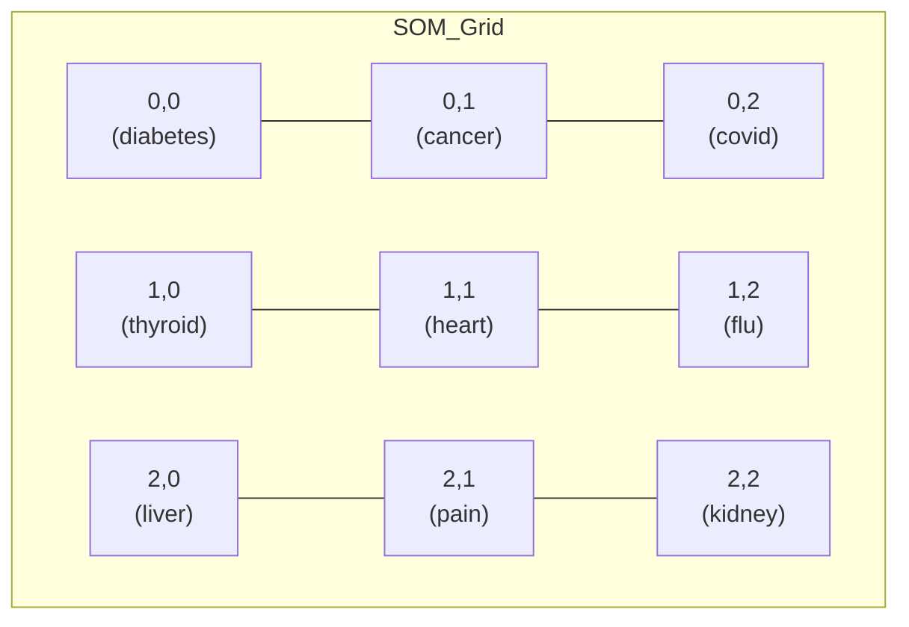

# 🧭 MediMap-XAI: Explainable Medical Search Framework

[](https://www.python.org/downloads/)  [](LICENSE)  [](https://streamlit.io)  [](https://www.mongodb.com/)  [](https://huggingface.co/)  

---

> **MediMap-XAI** is an **Explainable Medical Semantic Search & Clustering Framework** using **Self-Organizing Maps (SOMs)** with **BioBERT/SciBERT embeddings**.  
It enables **semantic clustering**, **interactive visualizations**, and **explainable retrieval** for unstructured medical data.

---

## 🎯 Hero Features

- 🔹 **Interactive SOM heatmap with keyword overlay**  
- 🔹 **Explainable Query → Article mapping**  
- 🔹 **Clustered semantic space** for reports, queries, and articles  
- 🔹 **Streamlit UI** with cell inspector & top keywords  
- 🔹 **Confidence analysis** for search results with detailed metrics  
- 🔹 **Medical document upload** for symptom analysis   

---

## 🧩 Key Features

- **A. Data Ingestion & Embedding**

 - 1. Supports multiple unstructured medical datasets:

      - a. Clinical reports (mtsamples.csv)

      - b. Medical Q&A (medquad.csv)

      - c. Patient drug reviews (drugsCom.csv)

      - d. Optional: PubMed / CORD-19 abstracts


 - 2. Domain-specific embeddings using BioBERT / SciBERT**

- **B. SOM-Based Semantic Clustering**

 - 1. 2D map of semantic space

 - 2. Assigns each document to a som_cluster

 - 3. Saves trained SOM → models/som_model.pkl


- **C. Interactive Streamlit UI**

 - 1. Combined SOM heatmap

 - 2. Cell inspector with:

      - a. Occupancy by collection

      - b. Sample documents

      - c. Top TF-IDF keywords

 - 3. Query → Article explanation panel


- **D. Explainability (XAI Layer)**

 - 1. Why a document sits in its cluster

 - 2. Query → Article explanation:

      - a. Cosine similarity in embedding space

      - b. Cluster proximity in SOM grid

      - c. Token-level contribution via leave-one-out embeddings

---

## 🏗️ Project Pipeline (Dynamic Mermaid Diagram)

```mermaid
flowchart LR
    A[Raw Data CSVs\n(Reports, Q&A, Drug Reviews)] --> B[Cleaning & Preprocessing\nDe-identification, Tokenization]
    B --> C[Embeddings\nBioBERT/SciBERT]
    C --> D[MongoDB Storage]
    D --> E[SOM Clustering\n(10x10 Map)]
    E --> F[XAI Layer\n(Query→Article + Token Importance)]
    F --> G[Streamlit UI\nInteractive Heatmap + Inspector]
```

---

## 🔹 Project Structure
```bash
MediMap-XAI/
├── app.py                         # Main Streamlit application
├── core/                          # Core application logic
│   ├── confidence_analyzer.py     # Confidence scoring and explanations
│   ├── file_handler.py            # File upload processing
│   ├── search_engine.py           # Semantic search implementation
│   ├── system_manager.py          # System initialization
├── data_ingestion.py              # Data ingestion pipeline
├── run_som_training.py            # SOM model training pipeline
├── src/                           # Core processing modules
│   ├── config.py                  # Paths and configurations
│   ├── db.py                      # MongoDB operations
│   ├── embedder.py                # BioBERT/SciBERT embeddings
│   ├── explainer.py               # Explanation generation
│   ├── ingest.py                  # Data ingestion logic
│   ├── search.py                  # Vector search implementation
│   ├── som_clusterer.py           # SOM training and clustering
│   ├── som_visualizer.py          # SOM visualization tools
│   └── utils.py                   # Utility functions
├── ui/                            # User interface components
│   ├── components.py              # Streamlit UI components
│   ├── layouts.py                 # Page layouts
│   └── visualizations.py          # Interactive visualizations
├── data/raw_data/                 # Medical datasets
│   ├── drug_reviews.csv
│   ├── medical_qa.csv
│   └── medical_reports.csv
├── models/                        # Trained models and visualizations
│   ├── som_model.pkl
│   └── visualizations/
├── logs/                          # System logs
│   ├── data_ingestion.log
│   └── model_training.log
├── requirements.txt               # Python dependencies
└── README.md                      # Project documentation
```

---

## 📊 Hero SOM Heatmap (Mermaid Mockup)

Visualizes SOM clusters with keyword overlays.
Hover in Streamlit UI for live documents & explanations.



(For real visual, use the Streamlit heatmap which auto-populates from MongoDB.)

---

## ⚡ Quickstart

- **1. Setup Environment**
```bash
git clone https://github.com/satyaki-mitra/MediMap-XAI.git
cd MediMap-XAI
python -m venv .venv
source .venv/bin/activate  # Linux/Mac
pip install -r requirements.txt
python -c "import nltk; nltk.download('punkt')"
```

- **2. Data Ingestion**
```bash
python data_ingestion.py
```
- Processes medical datasets

- Generates embeddings

- Stores data in MongoDB

- **3. Train SOM Model**
```bash
python run_som_training.py
```
- Trains Self-Organizing Map

- Assigns documents to clusters

- Generates visualizations

- Validates model performance

- **3. Launch Application**
```bash
streamlit run app.py
```
---

### 🧪 Explainable Query → Article Example

- Query: "I have frequent urination and excessive thirst. Could it be diabetes?"

- XAI Output in Streamlit:
                          - Cosine similarity: 0.873

                          - Cluster distance: 1.0

                          - Top contributing tokens:

                          - diabetes (+0.082)

                          - thirst (+0.047)

                          - urination (+0.036)

> ✅ Explains why the query matched those articles and its cluster.

----

## 📈 Future Enhancements

- Interactive cluster labeling for domain experts

- FAISS/Qdrant for high-scale vector retrieval

- Attention-based token attribution for deeper interpretability

- Multi-lingual medical embeddings

----

## 📝 License

- This project is licensed under the **MIT License** - see the [LICENSE](LICENSE) file for details.

---

## 🙋 Author

**Satyaki Mitra**  
*Data Scientist | AI-ML Enthusiast*

> ***Use only de-identified / synthetic medical data to comply with HIPAA/GDPR.***

